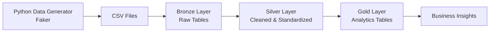
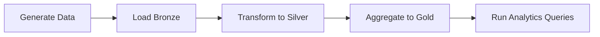

# 📦 Retail Lakehouse Data Platform

> End-to-end **Data Engineering pipeline** implementing a **Medallion Architecture (Bronze → Silver → Gold)** to transform raw retail data into analytics-ready insights.

---

## 🚀 Overview

This project simulates a real-world **retail analytics platform** that ingests and processes data from:

- Point-of-Sale (POS) systems  
- E-commerce platforms  

The pipeline transforms raw operational data into **clean, structured, and aggregated datasets** used for:

- Product performance analysis  
- Revenue tracking  
- Sales channel comparison  
- Store-level insights  

---

## 🧠 What This Project Demonstrates

- Designing an **end-to-end ETL pipeline**
- Implementing **Medallion Architecture**
- Handling **multi-source data (POS + E-commerce)**
- Writing **analytical SQL transformations**
- Creating **business-ready data models**
- Performing **data quality validation**
- Structuring a **production-style repository**

---

## 🏗️ Architecture



---

## 🔄 Data Flow



---

## 🧱 Medallion Architecture

### 🟤 Bronze Layer (Raw Data)

Stores raw ingested data with minimal transformation.

**Characteristics:**
- Append-only
- Preserves source structure
- Includes metadata (`batch_id`, `loaded_at`)

**Tables:**
- `bronze.customers_raw`
- `bronze.products_raw`
- `bronze.pos_sales_raw`
- `bronze.ecom_orders_raw`
- `bronze.ecom_order_items_raw`
- `bronze.inventory_raw`

---

### ⚪ Silver Layer (Cleaned Data)

Transforms raw data into **clean, consistent, and structured datasets**.

**Operations:**
- Deduplication
- Data type normalization
- Relationship enforcement
- Data validation

**Tables:**
- `silver.customers`
- `silver.products`
- `silver.pos_sales`
- `silver.ecom_orders`
- `silver.ecom_order_items`
- `silver.inventory`

---

### 🟡 Gold Layer (Analytics Layer)

Business-ready aggregated tables for analytics and reporting.

**Tables:**
- `gold.daily_revenue`
- `gold.daily_revenue_by_channel`
- `gold.product_revenue`
- `gold.product_revenue_by_channel`
- `gold.store_pos_performance`

---

## 🧩 Data Model Overview

This project simulates a retail ecosystem with the following entities:

- **Customers** → Users placing orders  
- **Products** → Product catalog  
- **POS Sales** → In-store transactions  
- **E-commerce Orders** → Online purchases  
- **Order Items** → Product-level granularity  
- **Inventory** → Store-level stock  

These entities are transformed into analytics datasets that power business insights.

---

## ⚙️ Technology Stack

| Category | Tools |
|--------|------|
| Programming | Python |
| Data Processing | Pandas |
| Data Generation | Faker |
| Database | PostgreSQL |
| Query Language | SQL |
| Containerization | Docker |
| Version Control | Git, GitHub |

---

## 📂 Project Structure

```
retail-lakehouse
│
├── ingestion
│   ├── data_generator.py
│   └── load_bronze.py
│
├── sql
│   ├── bronze
│   ├── silver
│   └── gold
│
├── docker
├── dbt
├── dashboards
├── quality
├── docs
│
├── README.md
└── .gitignore
```

---

## 🔄 Pipeline Workflow

### 1️⃣ Data Generation

```bash
python ingestion/data_generator.py
```

Generates synthetic retail datasets:
- Customers
- Products
- POS transactions
- E-commerce orders
- Order items
- Inventory

---

### 2️⃣ Bronze Ingestion

```bash
python ingestion/load_bronze.py
```

Loads raw CSV data into PostgreSQL Bronze tables.

---

### 3️⃣ Silver Transformation

- Cleans data  
- Removes duplicates  
- Standardizes schema  

---

### 4️⃣ Gold Aggregation

Creates business-level metrics for analytics.

---

## 📊 Example Analytics

### 🔝 Top Revenue Products

```sql
SELECT *
FROM gold.product_revenue
ORDER BY total_revenue DESC
LIMIT 10;
```

---

### 💰 Revenue by Channel

```sql
SELECT *
FROM gold.product_revenue_by_channel;
```

---

### 🏪 Store Performance

```sql
SELECT *
FROM gold.store_pos_performance
ORDER BY pos_revenue DESC;
```

---

### 📅 Daily Revenue

```sql
SELECT *
FROM gold.daily_revenue;
```

---

## 🧪 Data Quality Checks

Example validation:

```sql
SELECT order_id, product_id, COUNT(*)
FROM silver.ecom_order_items
GROUP BY order_id, product_id
HAVING COUNT(*) > 1;
```

**Other checks include:**
- Missing product references  
- Invalid customer relationships  
- Negative values  
- Inventory inconsistencies  

---

## 📈 Example Output

| product_id | pos_revenue | ecom_revenue | total_revenue |
|------------|------------|-------------|---------------|
| P0019 | 9972.70 | 2177.03 | 12149.73 |
| P0084 | 8374.87 | 2586.09 | 10960.96 |
| P0062 | 9678.58 | 1186.67 | 10865.25 |

---

## 💡 Insights Enabled

This pipeline enables:

- Identification of top-performing products  
- Channel performance comparison (POS vs E-commerce)  
- Store-level revenue analysis  
- Daily revenue trend tracking  

---

## ▶️ How to Run

```bash
.\venv\Scripts\activate
python ingestion/data_generator.py
python ingestion/load_bronze.py
```

Then run SQL scripts in:

```
sql/silver
sql/gold
```

---

## 🔮 Future Improvements

- Add **Apache Airflow orchestration**
- Implement **dbt transformation layer**
- Add **data quality automation**
- Deploy to **AWS / Snowflake**
- Build **BI dashboards (Power BI / Superset)**

---

## 👤 Author

Bilal Mushtaq  
MS Computer Science (Artificial Intelligence)  
Data Engineering | Machine Learning | Analytics  

GitHub: https://github.com/BilalMushtaq